<p align="center"></p>
<h1 align="center">Atlas CMMS × Offline Protocol</h1>
<p align="center"><b>Offline work-order handoff between technicians, with no backend and no internet</b></p>

This repo is a fork of [Atlas CMMS](https://github.com/grashjs/cmms), an open-source maintenance management system
(web, mobile and a Spring Boot API), with the **Offline Protocol SDK** integrated into its mobile app.

Two field technicians, one on an iPhone and one on Android, work the same work order in a plant room with no
signal. Over encrypted Bluetooth LE, and with no server involved, they can exchange notes, checklist ticks and status
changes, and hand the job from one to the other. When either phone gets a connection again, the offline history
reconciles into Atlas exactly once, under the right names, with conflicts resolved by a defined policy.

| Dir | Contents |
|---|---|
| `mobile/` | Expo / React Native app, with the offline handoff screen and the SDK integration |
| `api/` | Spring Boot backend, with device registration, crew lookup and the offline sync endpoint |
| `frontend/` | Atlas web app (unchanged; used to watch the work order reconcile) |
| `scripts/offline-demo/` | Demo seed and reset scripts |
| `screenshots/` | The screenshots used below |

## How it works

Every change made on the handoff screen becomes an **op**: one immutable, signed record (`NOTE`, `STATUS`,
`TASK_UPDATE`, `HANDOFF_REQUEST` or `HANDOFF_ACCEPT`). The phone stores the op, sends it straight to every other crew
member over BLE, and displays a **merged view**: the last server snapshot of the work order with every unsynced op
applied in a fixed order. When the backend is reachable again, any phone uploads every op it holds, and Atlas
applies each op exactly once, as its author.

```
 Alice's phone                                      Bob's phone
 handoff screen ─▶ op ─▶ sign ─▶ store ─▶ send ═BLE═▶ verify ─▶ store ─▶ merged view
                                  │      (MLS 1:1)                 │
                                  └──── when online: POST /offline/ops ────┘
                                                    ▼
                         Atlas API: dedup → verify → authorize → apply as author
```

The SDK provides the transport: BLE discovery and links, MLS-encrypted 1:1 messages, an outbox with retries and
delivery acknowledgements, and a per-device Ed25519 identity. The app adds the domain on top: who is on the crew,
what an op means, how ops merge, and how they reach Atlas.

## Features exercised

### Identity and permissions
- Each Atlas user gets one SDK identity per phone. Its address (`off1…`) is self-certifying: it is derived from the
  device's Ed25519 public key, which never leaves the Keychain or EncryptedSharedPreferences.
- While online, the phone registers its address and key with Atlas (`POST /offline/devices`). The server checks that
  the address really derives from the key and binds it to the logged-in user.
- Opening a work order online snapshots its **crew**: every user Atlas lets edit it who has a registered device. Offline,
  the crew is the allowlist. An op is accepted only if its sender and author are both on the crew, and a user who isn't
  sees the screen without any actions.
- At sync, the server re-checks permissions on live data, which is authoritative.

### Service discovery
- Each phone registers the mesh service `atlas.handoff`. While the handoff screen is open it queries for the service
  every 5 s, and **Nearby crew** shows the crew members whose devices answered in the last 30 s, with signal strength.
- Discovery traffic is signed but not encrypted, so it carries no work-order or company data.
- If Bluetooth is off or the permission was refused, the screen says so and offers **Open Settings**.

### Encrypted exchange
- Each op travels as a 1:1 SDK message to every other crew member. The SDK encrypts every message with MLS 1:1
  sessions whose keys are exchanged automatically when the phones meet; plaintext sends are disabled.
- On top of transport encryption, each op is **signed by its author**. Receivers verify it with the author's key from
  the crew snapshot, and the server verifies it again, so an op relayed or uploaded by someone else can't be forged.

### Persistent local storage
- Ops, the Lamport clock, the offline work-order pack (work order, tasks, crew), delivery state and sync results live
  in a Redux slice persisted to AsyncStorage. The SDK persists its own outbox, dedup set, MLS sessions and identity.
- The last login is cached, so the app cold-starts in airplane mode with the user still logged in and nothing lost.

### Delivery receipts
- Every send is tracked per (message, recipient) from SDK events: **Sent → Retrying (n) → Delivered**, or **Failed**
  with a **Resend** button.
- Delivered is the SDK's end-to-end acknowledgement from the recipient's device: a machine receipt, not a human one.

### Human acknowledgement
- A handoff is two signed ops: `HANDOFF_REQUEST` from the current technician, with an optional note, and
  `HANDOFF_ACCEPT` from the crew member who takes it. The receiver gets an **Accept responsibility** prompt.
- "Handoff accepted by Bob Okafor" is shown separately from the "Delivered" receipts: delivered means the phone got
  it; accepted means a person took responsibility and signed for it. At sync, the acceptor becomes primary assignee.

### Retries
- Retries belong to the SDK outbox: a 10 s acknowledgement timeout, then exponential backoff up to 300 s. Messages
  for unreachable peers are persisted across restarts for up to 7 days. The app has no retry loop of its own.
- The phone shows the retry count as "Retrying (n)" and flips to Delivered by itself when the peer is back.

### Deduplication
- An op's id is the identity of the change, however many times it is sent or uploaded.
- On the phone, the SDK drops repeated messages and the app keeps only the first copy of an op id.
- On the server, `offline_op.op_id` is unique. The first upload applies the op; every later upload, by anyone,
  returns `DUPLICATE` and creates no second comment, notification or webhook.

### Backend reconciliation
- Sync runs when the backend becomes reachable again (a successful API call, not just an OS network flag) or on
  **Sync now**. Each phone uploads every op it holds, including ops it received from crew members.
- `POST /offline/ops` processes them in `(lamport, author)` order: claim the op id, verify the device and signature,
  check the author may still edit the work order, then apply it **as the author** through Atlas's normal services.
  Notes and handoffs become comments, so history and notifications name the real author.
- Each op gets a badge on the phone (**Synced**, **Already synced**, **Conflict** or **Rejected**), and a toast
  summarizes the run.

### Concurrent edits with a defined resolution policy
One rule runs in two places, on every phone and on the server:
- **Order:** ops are sorted by `(lamport, authorAddress)`. A change made after receiving another one sorts after it.
- **Compare-and-set:** status, task and handoff-accept ops carry the value the user saw. An op applies only if the
  field still has that value; otherwise it is a **Conflict** and the earlier value stays. Notes never conflict.
- **Phones converge without a coordinator:** two offline edits of the same field get the same Lamport clock, so the
  tie goes to the lower device address, identically on every phone.
- **The server wins:** if the field changed in Atlas while the phones were offline, the op conflicts at sync, isn't
  applied, and a conflict comment records what was lost.

## What was added to Atlas

The integration is mostly new files: about 4,300 lines added and 64 removed. In existing Atlas code, the mobile
app gains an **Offline handoff** entry on the work order menu, a login that survives a cold start with no network,
reachability tracking in its API client, and an offline pack captured whenever a work order opens. The API gains a
Liquibase changelog. The web app is unchanged.

| Side | Files |
|---|---|
| Mobile | `contexts/MeshContext.tsx` (SDK lifecycle, device registration, discovery, inbound pipeline, sync triggers) · `slices/offline.ts` (persisted offline state, `createOp`, `syncOffline`) · `utils/offlineOps.ts` (pure op logic and merge, no SDK or React imports) · `utils/offlineCrypto.ts` (signing) · `screens/workOrders/OfflineHandoffScreen.tsx` · `screens/MeshDiagnosticsScreen.tsx` |
| API | `controller/OfflineController` · `service/OfflineDeviceService` · `service/OfflineSyncService` · `model/OfflineDevice`, `model/OfflineOp` · Liquibase changelog `db/changelog/2026_10_02_1790943770_offline_handoff.xml` (tables `offline_device`, `offline_op`) |
| Scripts | `scripts/offline-demo/seed.mjs` (demo company, users, work order) · `reset.sh` (returns the work order to its seeded state) · `firebase-stub.sh` (placeholder Firebase config for local builds) |

### Formats

An **op** is a JSON body, signed by its author's device:

```ts
type OpBody = {
  v: 1;
  opId: string;            // 24 hex chars, unique per change
  companyId: number;
  workOrderId: number;
  type: 'NOTE' | 'STATUS' | 'TASK_UPDATE' | 'HANDOFF_REQUEST' | 'HANDOFF_ACCEPT';
  authorUserId: number;
  authorAddress: string;   // SDK off1… address of the authoring device
  lamport: number;         // per-device Lamport clock; with authorAddress, the ordering key
  occurredAt: number;      // wall clock, display only
  payload:                 // by type:
    | { text: string }                                              // NOTE
    | { base: WOStatus; to: WOStatus }                              // STATUS
    | { taskId: number; field: 'value' | 'notes'; base: string | null; to: string | null }  // TASK_UPDATE
    | { note?: string }                                             // HANDOFF_REQUEST
    | { requestOpId: string; basePrimaryUserId: number | null };    // HANDOFF_ACCEPT
};

type Envelope = { body: string; sig: string };  // body = JSON.stringify(OpBody); sig = base64 Ed25519 over utf8(body)
```

Over the mesh, ops travel as `{"t": "atlas.ops.v1", "ops": [Envelope, …]}`, one high-priority 1:1 message per crew
member. The API adds three endpoints under `/offline`, all behind Atlas's normal JWT auth and tenant scoping:

| Endpoint | Purpose |
|---|---|
| `POST /offline/devices` | Register `{address, publicKey}` for the logged-in user. 400 if the address doesn't derive from the key; 409 if it belongs to someone else. |
| `GET /offline/work-orders/{id}/crew` | Everyone who may edit the work order and has a registered device, with address and public key. |
| `POST /offline/ops` | Upload up to 200 envelopes. Each gets `APPLIED`, `DUPLICATE` (with the original outcome), `CONFLICT` (with the server's winning value) or `REJECTED` (`bad_envelope`, `unknown_device`, `bad_signature`, `forbidden`). |

Offline notes and handoffs become ordinary Atlas comments, e.g.
`[Offline update · 2026-10-07 16:07] Condenser fan bearing is noisy. Replacement ordered, Bob to fit it. · synced by Bob Okafor`, stamped in the company's
time zone.

## Demo run, step by step

Recorded on 2026-10-07 with Release builds on a Samsung Galaxy M17 (**Alice**, Android) and an iPhone 16 (**Bob**,
iOS), with real airplane mode. The seeded work order is *CH-2 quarterly inspection*, assigned to both, with Alice as
primary. To run it yourself, see [Running the demo](#running-the-demo).

### 1. Both technicians open the work order online
Each phone has registered its device with Atlas, so it can fetch the crew: everyone who may edit this work order.

<table><tr><th>Alice (Android)</th><th>Bob (iOS)</th></tr><tr>
<td>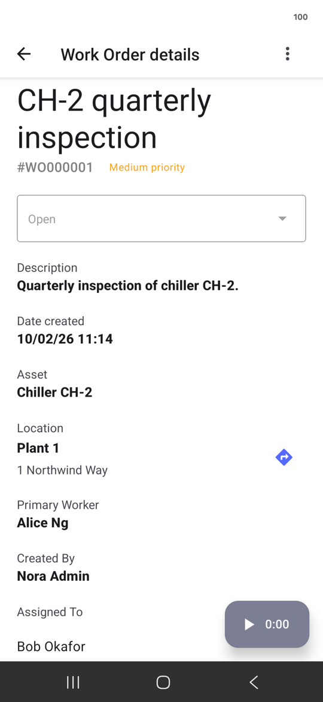</td>
<td>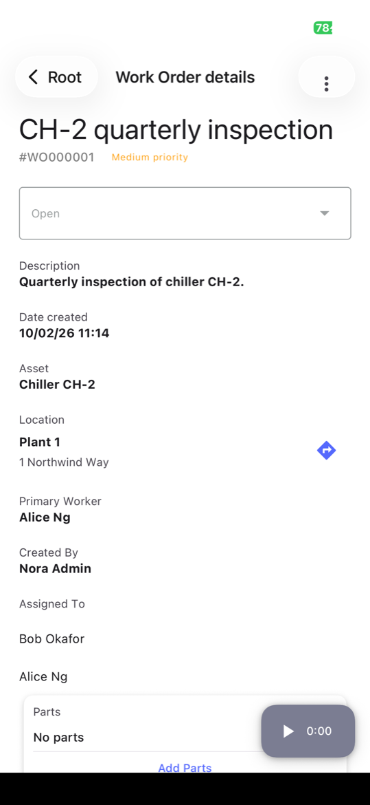</td>
</tr></table>

### 2. They open the offline handoff screen and find each other
⋮ → **Offline handoff**. Each phone discovers the other over BLE and lists it under **Nearby crew** with its signal
strength.

<table><tr><th>Alice (Android)</th><th>Bob (iOS)</th></tr><tr>
<td>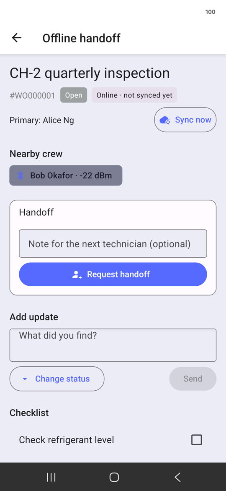</td>
<td>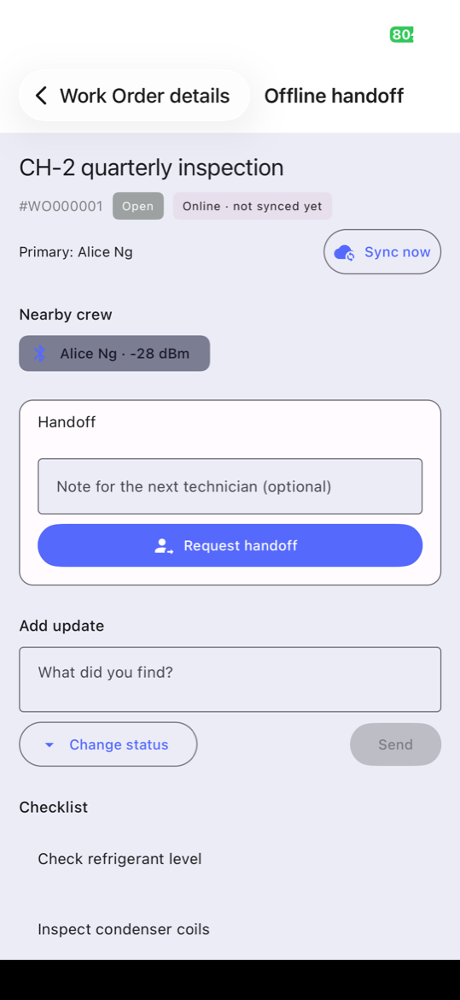</td>
</tr></table>

### 3. Both phones go offline
Airplane mode on, Wi-Fi off, Bluetooth on. The **Offline** chip and banner appear; the radio link between the phones
is all that remains. *(Identity and permissions, service discovery)*

<table><tr><th>Alice (Android)</th><th>Bob (iOS)</th></tr><tr>
<td>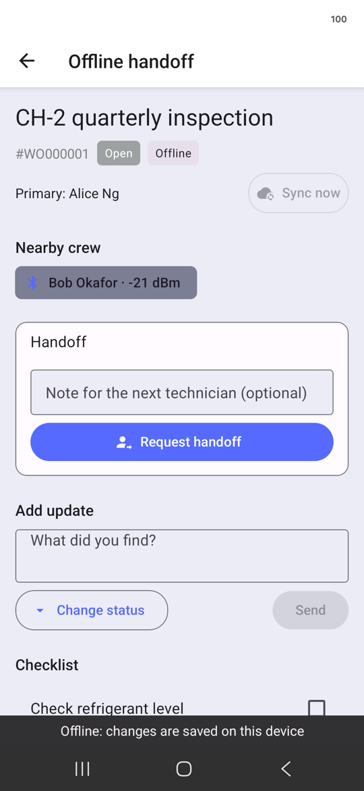</td>
<td>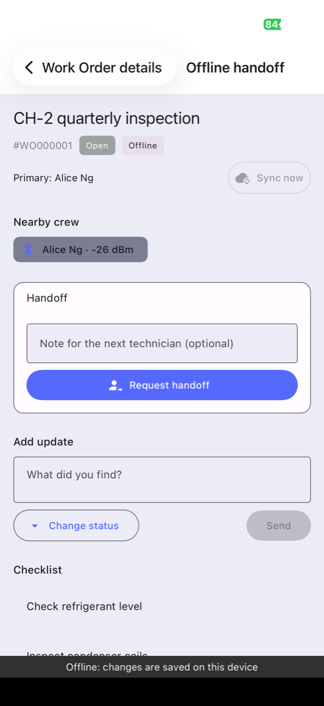</td>
</tr></table>

### 4. Alice records a note and ticks two checklist items
Each change is signed by Alice's device, stored locally and sent to Bob encrypted. Her timeline shows
**To Bob: Delivered** for each; Bob's phone shows the same entries and the ticked tasks.
*(Encrypted exchange, persistent local storage, delivery receipts)*

<table><tr><th>Alice (Android)</th><th>Bob (iOS)</th></tr><tr>
<td>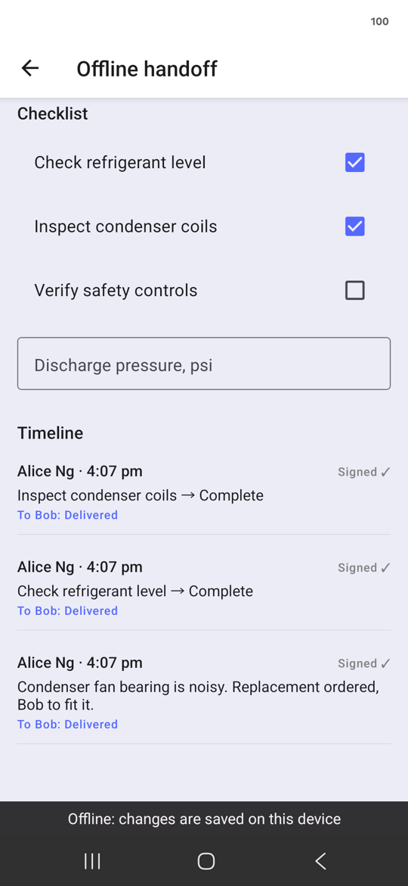</td>
<td>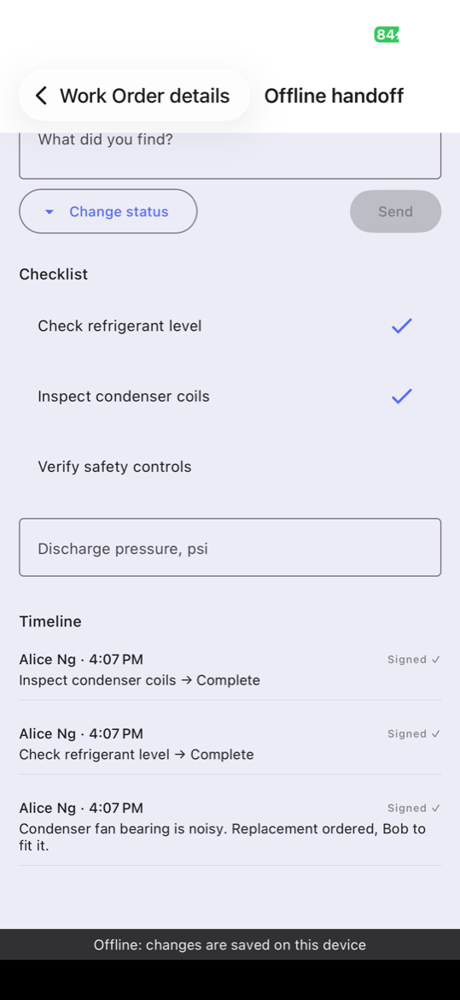</td>
</tr></table>

### 5. Alice requests a handoff
Alice adds a note for Bob and taps **Request handoff**. Her card waits for a crew member to accept; Bob's phone pops
up the request.

<table><tr><th>Alice (Android)</th><th>Bob (iOS)</th></tr><tr>
<td>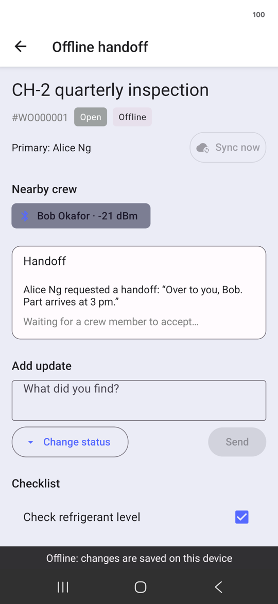</td>
<td>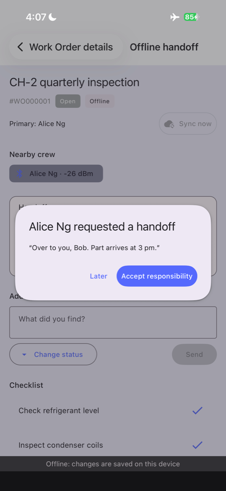</td>
</tr></table>

### 6. Bob accepts responsibility
Bob's acceptance is its own signed op. Both phones show **Handoff accepted by Bob Okafor** and Bob as primary.
*(Human acknowledgement)*

<table><tr><th>Alice (Android)</th><th>Bob (iOS)</th></tr><tr>
<td>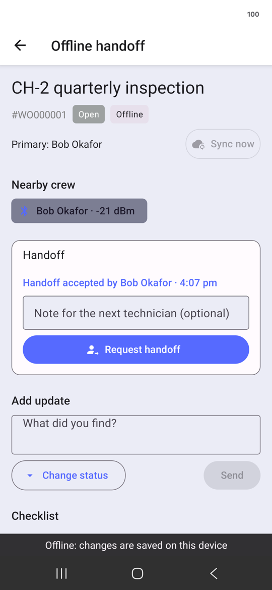</td>
<td>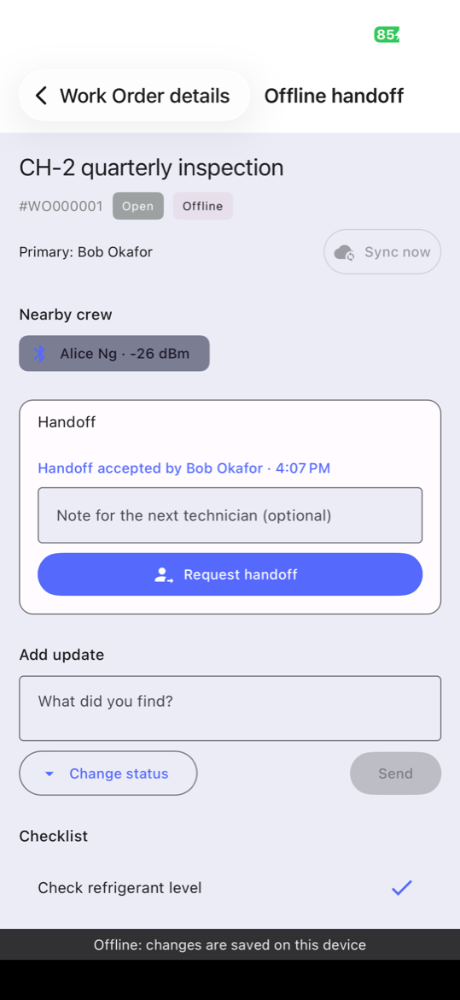</td>
</tr></table>

### 7. Delivered is not the same as accepted
The timelines keep the machine receipt (**To Bob: Delivered**, **To Alice: Delivered**) separate from the human one
(**Accepted responsibility**, signed by Bob).

<table><tr><th>Alice (Android)</th><th>Bob (iOS)</th></tr><tr>
<td>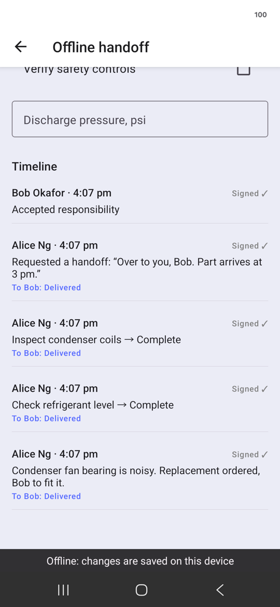</td>
<td>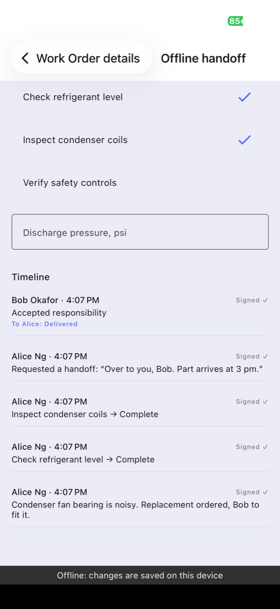</td>
</tr></table>

### 8. Bob force-quits the app and relaunches it, still offline
He is still logged in, and the timeline, the handoff and the delivery state are all still there. Nothing lived only
in memory. *(Persistent local storage)*

<table><tr><th>Alice (Android)</th><th>Bob (iOS)</th></tr><tr>
<td align="center"><i>No action on Alice's phone.</i></td>
<td></td>
</tr></table>

### 9. Retries: Bob drops out, Alice keeps working
Bob turns Bluetooth off. Alice sends another note; with Bob out of range, it shows **To Bob: Retrying (4)**.
*(Retries)*

<table><tr><th>Alice (Android)</th><th>Bob (iOS)</th></tr><tr>
<td>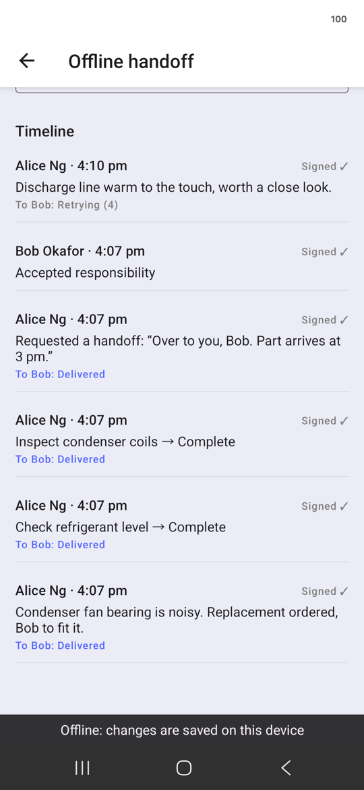</td>
<td>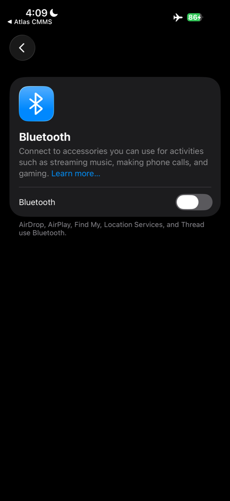</td>
</tr></table>

### 10. Bob comes back and the note arrives on its own
Bob turns Bluetooth back on and returns to Atlas. About 20 s later Alice's note flips to **Delivered** and appears in
Bob's timeline, with no user action.

<table><tr><th>Alice (Android)</th><th>Bob (iOS)</th></tr><tr>
<td>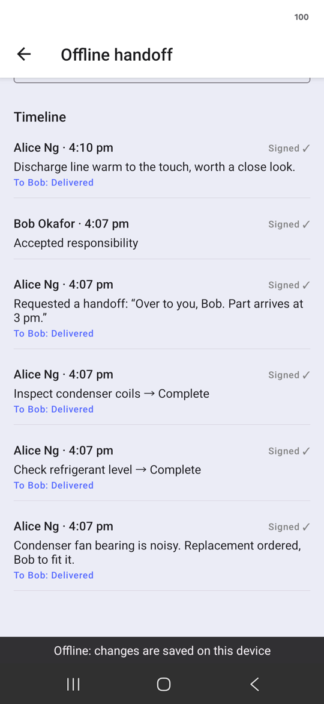</td>
<td>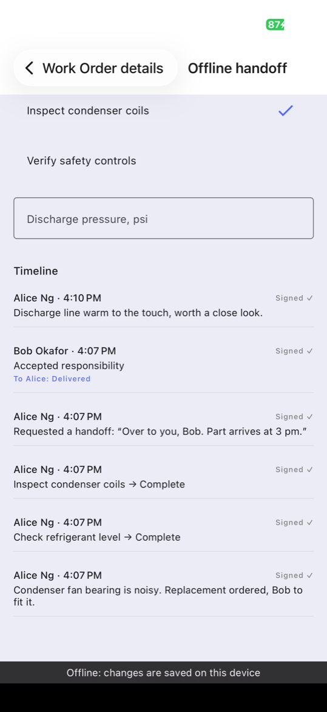</td>
</tr></table>

### 11. Concurrent edits: both change the status while apart
With Bob's Bluetooth off again (his screen shows the Bluetooth card), Alice sets **On Hold** and Bob sets
**In Progress**. Meanwhile an admin sets the work order to **Complete** in Atlas, which neither phone can see.

<table><tr><th>Alice (Android)</th><th>Bob (iOS)</th></tr><tr>
<td>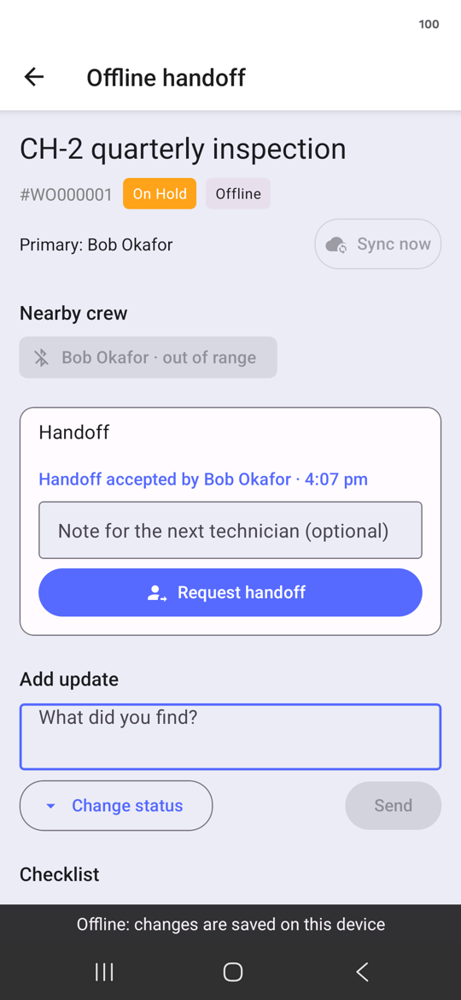</td>
<td>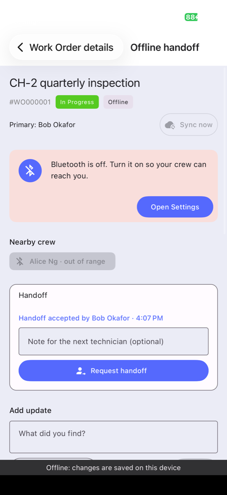</td>
</tr></table>

### 12. The phones meet again and agree on a winner
13 s after Bob's Bluetooth comes back, both phones show **In Progress**. Both edits had the same Lamport clock, so the
tie went to the lower device address (Bob's) on both phones, with no coordinator.
*(Concurrent edits with a defined resolution policy)*

<table><tr><th>Alice (Android)</th><th>Bob (iOS)</th></tr><tr>
<td>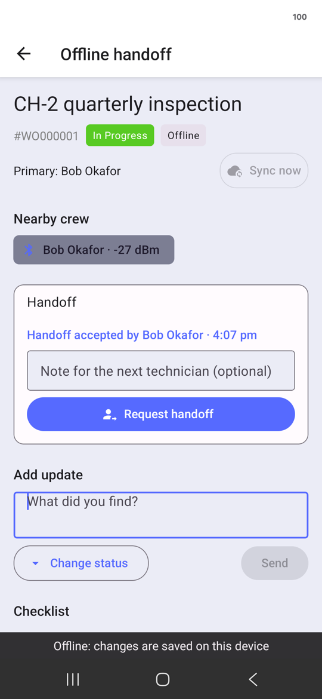</td>
<td>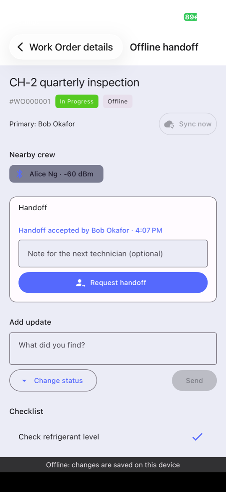</td>
</tr></table>

### 13. The losing edit is flagged, not silently dropped
Alice's On Hold entry reads **Conflict: Bob's In Progress came first** on both phones.

<table><tr><th>Alice (Android)</th><th>Bob (iOS)</th></tr><tr>
<td>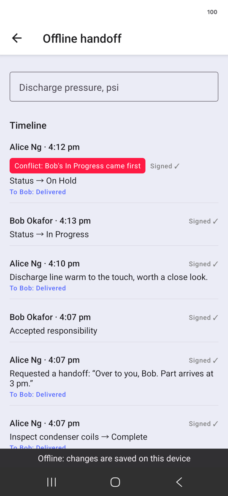</td>
<td>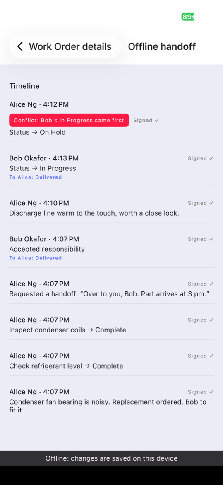</td>
</tr></table>

### 14. Back online: each phone syncs by itself
Bob turns airplane mode off first and uploads the shared history. Then Alice does; her toast reads
**6 already synced · 2 conflicts**, because Bob had already uploaded the same ops. Both phones now show **Complete**:
the admin's server-side edit wins. *(Backend reconciliation, deduplication)*

<table><tr><th>Alice (Android)</th><th>Bob (iOS)</th></tr><tr>
<td>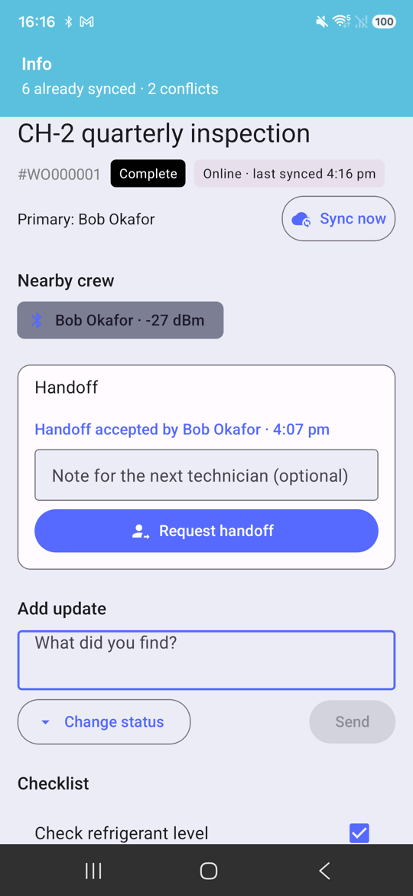</td>
<td>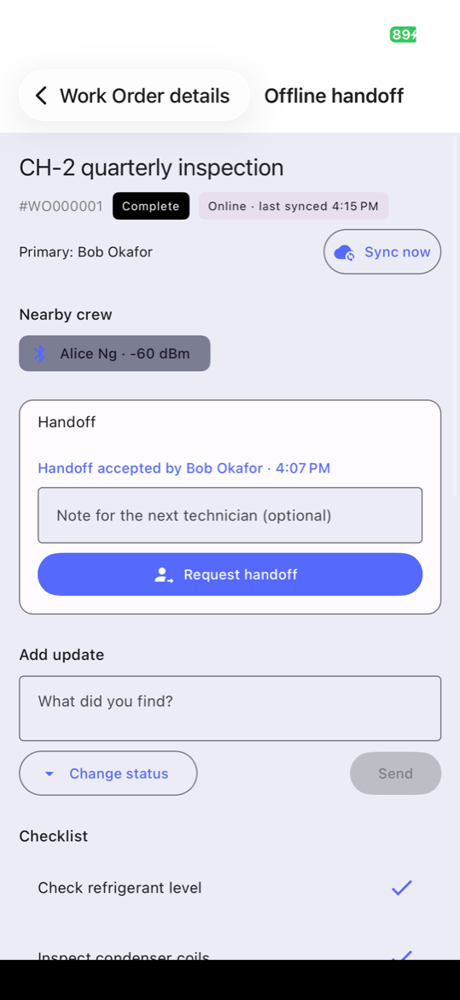</td>
</tr></table>

### 15. The final record
Every op carries its sync outcome: **Synced** on Bob's phone (he uploaded them), **Already synced** on Alice's, and
**Conflict: server kept Complete** for both offline status changes.

<table><tr><th>Alice (Android)</th><th>Bob (iOS)</th></tr><tr>
<td>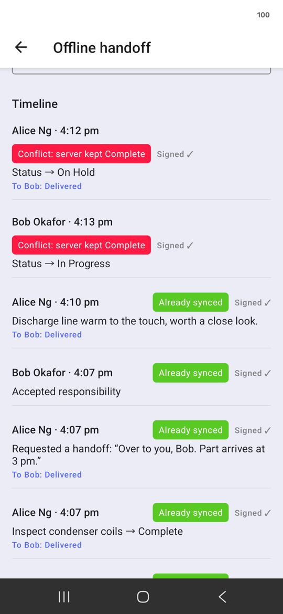</td>
<td>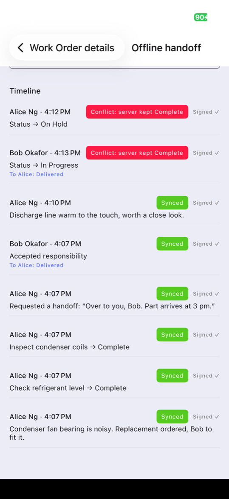</td>
</tr></table>

In Atlas, after both phones synced the same history:

| What | Result |
|---|---|
| Ops stored | 8, one per change, with no duplicates although both phones uploaded all of them |
| Comments on the work order | 6, each under its real author: Alice's two notes and handoff request, Bob's acceptance, and one conflict comment each for Alice's On Hold and Bob's In Progress |
| Primary assignee | Bob |
| Checklist | *Check refrigerant level* and *Inspect condenser coils* Complete |
| Status | Complete (the admin's edit; both offline status changes recorded as conflicts) |

## Running the demo

**You need:** Docker, Node 20+, Xcode and/or the Android SDK, and an iPhone and an Android phone. The
[Offline Protocol SDK](https://github.com/Offline-Protocol/offline-protocol-sdk) comes from npm as
`@offline-protocol/mesh-sdk` 0.28.0, with its iOS and Android native libraries prebuilt. The app is an Expo
dev-client project on React Native's old architecture; Expo Go can't run the SDK.

```bash
# 1. Backend: the Atlas stack, with the API built from this repo's source (first build takes ~10 min)
docker compose -f docker-compose.yml -f docker-compose.offline-demo.yml up -d --build
# 2. Demo data: company, admin, three technicians, and the CH-2 work order (idempotent)
API_URL=http://<LAN-IP>:3000/api node scripts/offline-demo/seed.mjs
# 3. Mobile: placeholder Firebase config, then Release builds (JS embedded, so they cold-start offline)
scripts/offline-demo/firebase-stub.sh
export API_URL=http://<LAN-IP>:3000/api/
cd mobile && npm install
npx expo run:android --variant release
npx expo run:ios --configuration Release --device
```

On Xcode 27, `expo run:ios` fails; build and install with Xcode's tools instead:

```bash
cd mobile/ios && pod install && xcodebuild -workspace AtlasCMMS.xcworkspace -scheme AtlasCMMS -configuration Release \
  -destination id=<device UDID> -derivedDataPath /tmp/atlas-dd -allowProvisioningUpdates build
xcrun devicectl device install app --device <device UDID> /tmp/atlas-dd/Build/Products/Release-iphoneos/AtlasCMMS.app
```

Logins (password `NorthwindDemo!2026` for all): `alice@northwind.test` and `bob@northwind.test` on the phones,
`admin@northwind.test` on the web UI at `http://<LAN-IP>:3000`.

Before each run:
- Run `scripts/offline-demo/reset.sh` to return the work order to its seeded state.
- Make sure neither phone has another Offline Protocol SDK app with Bluetooth access. They publish the same BLE
  service, and a peer can bind to the wrong app's identity.
- Log in on both phones while online, then open the work order and ⋮ → **Offline handoff** on each. The crew is
  snapshotted when the work order opens, so check that each phone lists the other.
- For airplane mode, keep Bluetooth on and turn Wi-Fi off (both platforms remember Wi-Fi). On the iPhone use Control
  Center: leaving Atlas for the Settings app suspends its Bluetooth.

**Checks:** `cd mobile && npm test -- --watchAll=false` runs the op logic, merge and signing tests.
`cd api && JAVA_HOME=$(/usr/libexec/java_home -v 17) mvn test -Dtest='Offline*IntegrationTest'` runs device
registration and sync against a real Postgres (Testcontainers; newer JDKs break Lombok, so pin 17).

### Signing

- **iOS:** the Xcode project ships with no development team, so set your own before the first build. Open
  `mobile/ios/AtlasCMMS.xcworkspace`, select the **AtlasCMMS** target → **Signing & Capabilities**, choose your team,
  and change the bundle identifier to one your team can register (the committed `com.offlineprotocol.atlasdemo` is
  already taken). Automatic signing creates the provisioning profile. With the `xcodebuild` route, you can pass the
  same settings on the command line instead: `DEVELOPMENT_TEAM=<team id> PRODUCT_BUNDLE_IDENTIFIER=<bundle id>`.
  You need a paid Apple Developer account: Atlas uses the Push Notifications and NFC capabilities, which free personal
  teams can't sign. Trust the developer certificate on the phone the first time (Settings → General → VPN & Device
  Management), with the phone online.
- **Android:** the release variant is signed with the project's debug keystore, which is enough to sideload onto a
  test phone. Distributing it needs your own keystore (see the React Native
  [signed APK guide](https://reactnative.dev/docs/signed-apk-android)).

## Known limits

- The crew is a snapshot taken when the work order is opened online. Someone removed from the work order while the
  phones are offline is still trusted until they reconnect; the server re-checks at sync.
- The SDK's delivery receipts are unsigned. Human acceptance is a signed op.
- iOS only runs BLE in the foreground, so the handoff screen keeps the display awake.
- Logging out clears the phone's unsynced ops. Crew members still hold copies.

**In scope:** notes, work-order status, checklist values, handoff request and accept; iOS and Android over BLE.
**Out of scope:** labor, parts, photos and attachments; creating work orders offline; other SDK transports (Wi-Fi
Direct, LAN, internet relay); changes to the web UI.

## Built on Atlas CMMS

[Atlas CMMS](https://github.com/grashjs/cmms) is a self-hosted maintenance management system for web and mobile:
work orders, preventive maintenance, assets, inventory, analytics and more. See its
[documentation](https://docs.atlas-cmms.com) for everything outside the offline handoff.

Atlas CMMS is dual-licensed under the [AGPLv3](./LICENSE) and a [commercial license](./COMMERCIAL_LICENSE.MD). The
Offline Protocol SDK is AGPL-3.0-only or commercial.
